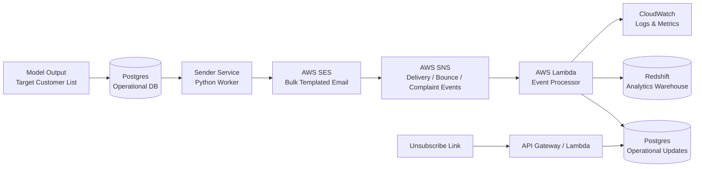

# Architecture – Email Management System

## High-level System Flow

## Component Responsibilities

### 1. Model Output
- Generates target customer list
- Adds week number and generation date
- Writes results into Postgres

### 2. Postgres (Operational Database)
- Stores customers, campaigns, recipients
- Maintains suppression list (unsubscribe, bounce, complaint)
- Tracks current send status

### 3. Sender Service (Python)
- Reads eligible recipients from Postgres
- Selects SES template based on week-of-month
- Supplies customer-specific template data
- Sends bulk emails via SES

### 4. AWS SES
- Handles bulk email delivery
- Applies email templates
- Emits delivery, bounce, and complaint events

### 5. AWS SNS
- Receives SES feedback events
- Fans out events to subscribers

### 6. AWS Lambda (Event Processor)
- Consumes SNS events
- Updates suppression list and recipient status in Postgres
- Writes immutable email events to Redshift

### 7. Redshift (Analytics Warehouse)
- Stores historical email events
- Supports reporting and trend analysis

### 8. CloudWatch
- Collects logs from Lambda
- Monitors failures and execution metrics

### 9. Unsubscribe Flow
- User clicks unsubscribe link in email
- API Gateway / Lambda processes request
- Email ad

