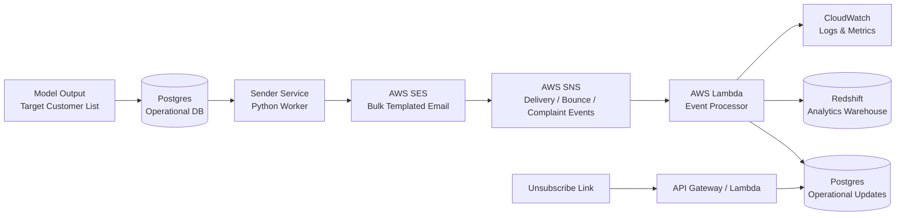

# Architecture – Email Management System

## High-level System Flow

## Component Responsibilities
### 1. Model Output

Generates target customer list

Adds week number and generation date

Writes results into Postgres

### 2. Postgres (Operational Database)

Stores customers, campaigns, and campaign recipients

Maintains suppression list (unsubscribe, bounce, complaint)

Tracks current send status (pending, sending, sent, etc.)

Acts as the source of truth for send eligibility

### 3. Sender Service (Python)

Runs as a scheduled batch job (weekly campaign execution)

Reads eligible recipients (status = pending) from Postgres in controlled batches

Marks recipients as sending to prevent duplicate sends

Selects SES template based on week-of-month

Supplies customer-specific template data

Pulls data from Postgres

Builds a JSON payload

Sends emails via SES using rate-limited batch sending

Throttle applied to respect SES sending limits

Batch size and send rate are configurable

Records SES message IDs and updates send status to sent or failed

Responsibility of Sender Service:
Apply business rules, batching, and rate control.
It does not handle delivery, bounce, or complaint logic.

### 4. AWS SES

Handles bulk email delivery

Applies email templates

Emits delivery, bounce, and complaint events

Responsibilities of AWS SES:

SMTP connections

Automatic retries

ISP and mailbox provider rules

Throttling enforcement

Sender reputation management

SES is responsible only for email delivery mechanics, not business logic.

### 5. AWS SNS

Receives email feedback events from SES

Fans out delivery, bounce, and complaint notifications to subscribers

### 6. AWS Lambda (Event Processor)

Consumes SNS events

Parses delivery, bounce, and complaint payloads

Updates:

suppression list (unsubscribe, complaint, hard bounce)

recipient status in Postgres

Writes immutable email event records to Redshift

Emits logs and metrics to CloudWatch

### 7. Redshift (Analytics Warehouse)

Stores historical email events (delivery, bounce, complaint, engagement)

Supports reporting and trend analysis

Not used for operational decision-making

### 8. CloudWatch

Collects logs from Lambda and sender execution

Monitors failures and execution metrics

Supports alerting on error rates and anomalies

### 9. Unsubscribe Flow

- User clicks unsubscribe link embedded in email

- Request handled via API Gateway / Lambda

- Email address added to suppression list in Postgres

- Future sends to this address are blocked immediately
