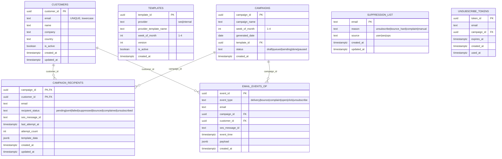

# Postgres Schema – Email Management System

This document defines the **operational database schema** used to
control email sending, compliance, and system state.

## Entity Relationship Diagram (ERD)

## Design Notes

- **campaign_recipients** uses a composite primary key
  (`campaign_id`, `customer_id`) to prevent duplicate sends.
- **suppression_list** is the authoritative source for compliance.
- **email_events_op** stores recent operational events for
  troubleshooting and support use cases.
- Full historical analytics are stored in Redshift.
