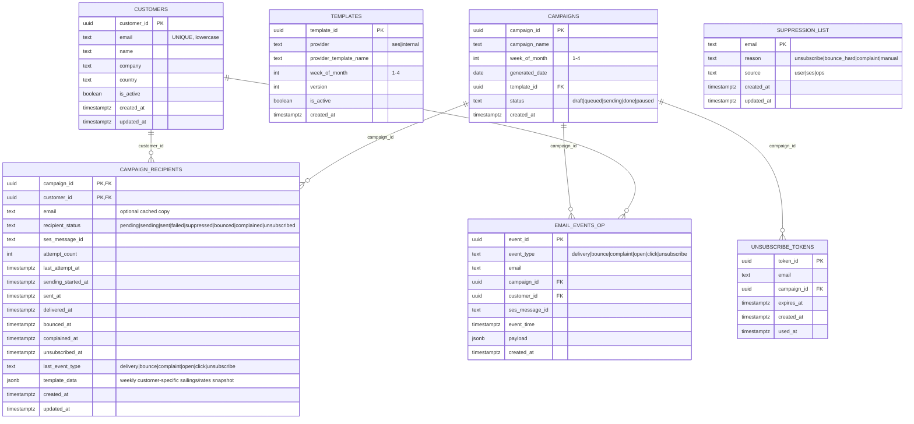

```mermaid
erDiagram
  CUSTOMERS {
    uuid customer_id PK
    text email "UNIQUE, lowercase"
    text name
    text company
    text country
    boolean is_active
    timestamptz created_at
    timestamptz updated_at
  }

  TEMPLATES {
    uuid template_id PK
    text provider "ses|internal"
    text provider_template_name
    int week_of_month "1-4"
    int version
    boolean is_active
    timestamptz created_at
  }

  CAMPAIGNS {
    uuid campaign_id PK
    text campaign_name
    int week_of_month "1-4"
    date generated_date
    uuid template_id FK
    text status "draft|queued|sending|done|paused"
    timestamptz created_at
  }

  CAMPAIGN_RECIPIENTS {
    uuid campaign_id PK, FK
    uuid customer_id PK, FK
    text email "optional cached copy"

    text recipient_status "pending|sending|sent|failed|suppressed|bounced|complained|unsubscribed"
    text ses_message_id
    int attempt_count
    timestamptz last_attempt_at

    timestamptz sending_started_at
    timestamptz sent_at
    timestamptz delivered_at
    timestamptz bounced_at
    timestamptz complained_at
    timestamptz unsubscribed_at
    text last_event_type "delivery|bounce|complaint|open|click|unsubscribe"

    jsonb template_data "weekly customer-specific sailings/rates snapshot"
    timestamptz created_at
    timestamptz updated_at
  }

  SUPPRESSION_LIST {
    text email PK
    text reason "unsubscribe|bounce_hard|complaint|manual"
    text source "user|ses|ops"
    timestamptz created_at
    timestamptz updated_at
  }

  UNSUBSCRIBE_TOKENS {
    uuid token_id PK
    text email
    uuid campaign_id FK
    timestamptz expires_at
    timestamptz created_at
    timestamptz used_at
  }

  EMAIL_EVENTS_OP {
    uuid event_id PK
    text event_type "delivery|bounce|complaint|open|click|unsubscribe"
    text email
    uuid campaign_id FK
    uuid customer_id FK
    text ses_message_id
    timestamptz event_time
    jsonb payload
    timestamptz created_at
  }

  CUSTOMERS ||--o{ CAMPAIGN_RECIPIENTS : "customer_id"
  CAMPAIGNS ||--o{ CAMPAIGN_RECIPIENTS : "campaign_id"
  CAMPAIGNS ||--o{ UNSUBSCRIBE_TOKENS : "campaign_id"
  CAMPAIGNS ||--o{ EMAIL_EVENTS_OP : "campaign_id"
  CUSTOMERS ||--o{ EMAIL_EVENTS_OP : "customer_id"
```
