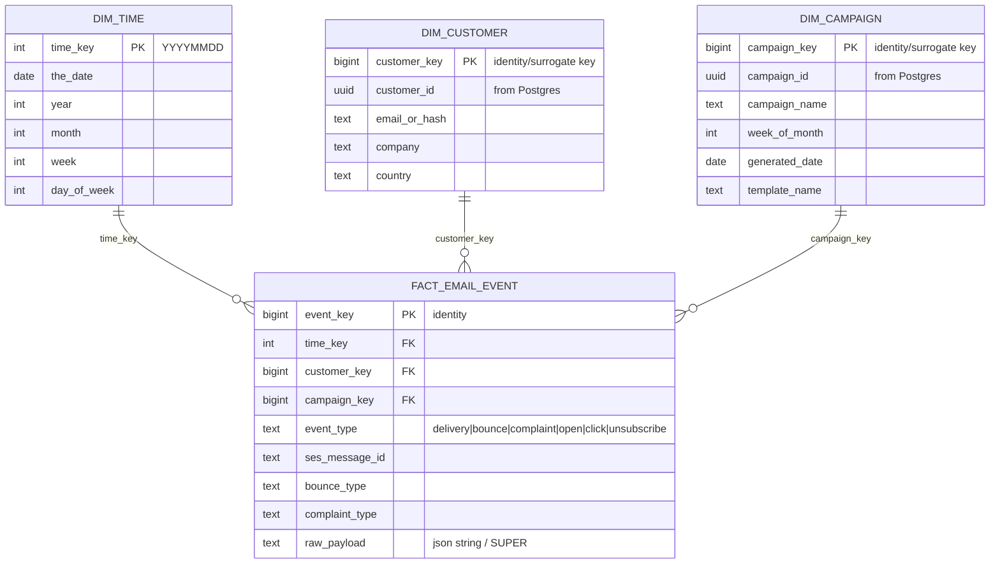

# Redshift Schema – Email Management System (Analytics)

This document defines the **analytics warehouse schema** used for reporting,
trend analysis, and dashboards. Redshift stores **historical, append-only**
event data.

## Entity Relationship Diagram (Star Schema)

## Why Redshift uses Facts and Dimensions

- **fact_email_event** is the append-only table of “things that happened.”
- **dim_customer / dim_campaign / dim_time** provide context for grouping,
  filtering, and trend reporting.
- This design is optimized for queries like:
  - delivery rate by week
  - bounce rate by domain
  - complaints by campaign
  - opens/clicks by customer segment

## Data Loading Notes (Typical)

### From Lambda / Event Pipeline
- Insert a row into **fact_email_event** for every SNS event
  (delivery/bounce/complaint, and later open/click).
- Maintain dimensions by:
  - Upserting dim tables from Postgres (batch ETL), or
  - Creating dimension rows when new IDs appear (streaming approach)

### Source of Truth
- Postgres remains the **operational source of truth**
  (suppression, send status, current state).
- Redshift remains the **historical analytics store**.
